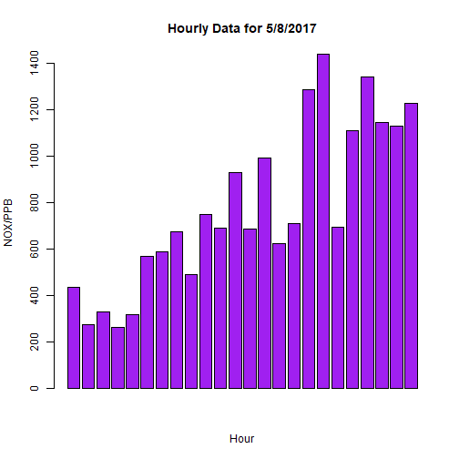

Reproducible Pitch For Shiny Web App
========================================================
author: R. Camara
date: 21/01/2018
autosize: true

Introduction
========================================================

This is the pitch for the Shiny App developed for the Data Products in R course project. The App looks at the Oxides of Nitrogen (NOX) pollution levels in London in 2017.

- It allows the user to interactively view the amount of NOX pollution per hour for each day of the month selected. 

- The bar chart displays the varying amount of NOX for each hour when the sliders are moved for each day of the month selected. 


The Data
========================================================
The data was obtained from https://goo.gl/Zc1sqE

- Below is a summary


```
     month             day             hour          value       
 Min.   : 1.000   Min.   : 1.00   Min.   : 0.0   Min.   :  66.8  
 1st Qu.: 4.000   1st Qu.: 8.00   1st Qu.: 6.0   1st Qu.: 589.7  
 Median : 7.000   Median :16.00   Median :12.0   Median :1002.3  
 Mean   : 6.511   Mean   :15.68   Mean   :11.5   Mean   :1130.4  
 3rd Qu.: 9.500   3rd Qu.:23.00   3rd Qu.:17.5   3rd Qu.:1580.5  
 Max.   :12.000   Max.   :31.00   Max.   :23.0   Max.   :4131.3  
```

Slide With Plot
========================================================
- This is the hourly pollution of NOX for the fifth day of August, 2017



Conclusion
========================================================
The first part of the assignment showing the ui and server files for the Shiny App can be found here https://github.com/rc202/DataProductsR
